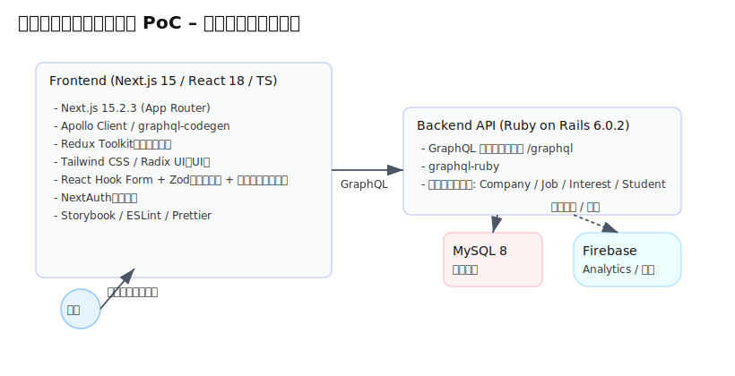

# README

---

## 1. 📌 プロジェクト概要

```
このプロジェクトは、
・Next.js 15
・GraphQL
・Ruby on Rails
・MySQL
を組み合わせたフルスタック構成のPoCアプリケーションです。

学生向け就活サービスを題材に設計・実装しています。
```

* **目的**：

  * Next.js App Router・GraphQL・Apollo Client・Railsバックエンド・認証基盤の理解
  * BFF的フロント設計 / 型駆動開発 / UI分離（Storybook）を実践

* **技術選定理由**：
  * Next.js 15: 最新のApp Routerアーキテクチャ理解およびServer Component実践
  * GraphQL + Codegen: データ型起点の開発とUI要求ベースAPI設計検証
  * Rails: ドメインモデル・永続化担当としてGraphQL API専任レイヤー化の検証
---

## 2. 🏗️ アーキテクチャ構成図



```
┌────────────────────────────────────────────┐
│ Next.js 15 (App Router, TS, Apollo, Redux) │
│   ├─ UI: Tailwind / Radix UI               │
│   ├─ GraphQL Hooks (generated)             │
│   └─ Auth: NextAuth                        │
└────────────────────────────────────────────┘
                 ↓ GraphQL
┌────────────────────────────────────────────┐
│ Ruby on Rails 6 (graphql-ruby, MySQL)      │
│   └─ Models: Company / Job / Interest      │
└────────────────────────────────────────────┘

┌────────────────────────────────────────────┐
│ Firebase Analytics (optional telemetry)    │
└────────────────────────────────────────────┘
```

---

## 3. 🚀 機能一覧

|カテゴリ|機能|使用技術|
|---|---|---|
|ユーザー|GitHubログイン|NextAuth|
|求職情報|求人一覧表示|GraphQL Query + SSG|
|詳細画面|求人詳細表示|Apollo Client|
|操作|「興味あり」クリック|GraphQL Mutation|
|プロフィール|入力/編集/保存|React Hook Form + Zod|
|開発DX|UIカタログ|Storybook|

---

## 4. 🧩 技術スタック

```
Frontend:
- Next.js 15 (App Router)
- React 18
- TypeScript 5
- Apollo Client + graphql-codegen
- Redux Toolkit
- Tailwind CSS + Radix UI
- React Hook Form + Zod
- NextAuth
- Storybook
- ESLint + Prettier

Backend:
- Ruby 3.1.x (Docker image base)
- Rails 6.1.7.x
- graphql-ruby
- MySQL 8

Infra:
- Docker / docker-compose
- Firebase Analytics
```

---

## 5. ⚙️ セットアップ手順

```sh
# 0. 環境変数テンプレートコピー(初回セットアップ前準備)
# （環境変数導入後に使用予定）
cp .env.example .env.local

# 1. 初回ビルド
docker compose build

# 2. DB起動
docker compose up -d db

# 3. Rails DB 作成
docker compose run --rm api bundle exec rails db:create db:migrate

# 4. アプリ起動
docker compose up

```
### 初回正常起動の判定チェック

### Next.js
http://localhost:3100 を開き、トップページが表示される（エラー画面でもOK）

### Rails API
http://localhost:3101/graphql を開き、GraphQLエンドポイントが見える
（404でもRails起動してればOK）

### MySQL
rails db:createが成功してればOK

---

## 6. 🔧 開発ポリシー

### 6-1. フロント設計方針

| 項目    | 方針                                                    |
| ----- | ----------------------------------------------------- |
| データ取得 | `Server Component → Apollo Client (Client Component)` |
| 状態管理  | Apolloで吸収できるものはApollo、UI状態はRedux                      |
| UI    | Tailwind基盤、再利用パーツはRadixベース                            |

---

### 6-2. GraphQL思想

* UIドリブンなスキーマ設計
* Mutationは意図が伝わる単位で設計
* graphql-codegen による型駆動

---

### 6-3. Next.js構成方針

| 区分     | 実装                                               |
| ------ | ------------------------------------------------ |
| データ取得  | `Server Components + Apollo (Client Components)` |
| 状態管理   | ビジネス状態＝Apollo / UI状態＝Redux Toolkit               |
| スタイリング | Tailwind + Radix UI（アクセシビリティ準拠）                  |

---

## 7. 🧪 Storybookドキュメント

```
npm run storybook
```

StorybookでUI/状態遷移確認可能。

例：

| コンポーネント       | Story例            |
| ------------- | ----------------- |
| `JobCard`     | 通常 / Hover / 応募済み |
| `ProfileForm` | バリデーションエラー / 初期状態 |

---

## 8. 📈 Firebase 計測項目

| イベント                  | 目的            |
| --------------------- | ------------- |
| `view_job_detail`     | 閲覧動線把握        |
| `send_interest_click` | エントリーアクションの評価 |

---

## 9. ✨ 今後の拡張予定

* 企業検索・フィルタ
* 管理画面（管理者ログイン）
* CI/CD（GitHub Actions）
など

---

## 10. 🔍 このPoCから得た学び

* GraphQL + codegen による型安全な開発
* App Router設計とServer/Client Component分離の実践
* Rails側責務とフロントBFF責務の整理の重要性

---

## 開発メモ

### ディレクトリ構成
```txt
CareermapPoc/
  backend/   # Rails 6 (GraphQL, MySQL)
  frontend/  # Next.js 15 (App Router 他)
  docker-compose.yml
  docs/
    architecture.svg
  README.md
```

### ポート
```yml
web:    ports: ["3100:3000"]  # Next.js
api:    ports: ["3101:3000"]  # Rails
db:     ports: ["3307:3306"]
```