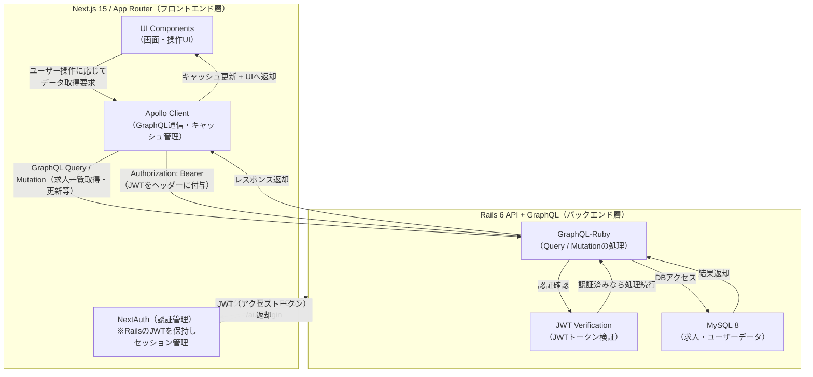

# README

---

## 1. プロジェクト概要

```txt
このプロジェクトは、
・Next.js 15 (App Router / TypeScript)
・GraphQL / Apollo Client
・Ruby on Rails (GraphQL API)
・MySQL / Docker Compose
を組み合わせたフルスタック構成のPoCアプリケーションです。

就活サービスを題材に設計・実装しています。
```

* **目的**：

  * Rails を REST ではなく GraphQL API 専用バックエンドとして扱う構成検証
  * Next.js App Router + Apollo Client のデータフロー理解
  * UI/UX と API の型駆動開発（GraphQL / Codegen）検証

* **技術選定理由**：
  * Next.js 15: 最新のApp Routerアーキテクチャ理解およびServer Component実践
  * GraphQL + Codegen: データ型起点の開発とUI要求ベースAPI設計検証
  * Rails: ドメインモデル・永続化担当としてGraphQL API専任レイヤー化の検証
---

## 2. アーキテクチャ構成図



---

## 3. 機能一覧

| 機能                | 使用技術                                                |
| ------------------ | ------------------------------------------------------- |
| ログイン / 認証       | NextAuth + Rails JWT (Hybrid認証構成)                  |
| ログインユーザー取得   | Apollo Client + Me Query                               |
| 求人一覧表示         | GraphQL Query／Apollo Client                           |
| 求人詳細             | Dynamic Route + GraphQL                                |
| 求人編集             | GraphQL Mutation                                       |
| Seed データ投入      | Rails seeds                                            |

---

## 4. 技術スタック

```
Frontend
- Next.js 15 (App Router)
- React 18
- TypeScript
- Apollo Client
- Tailwind CSS

Backend
- Ruby 3.1
- Rails 6.1 + graphql-ruby
- JWT 認証（NextAuth Credentials Provider と連携）

DB
- MySQL 8

Infra / Dev
- Docker
- Make (Task Runner)
```

---

## 5. セットアップ手順

このアプリは Next.js（App Router） + NextAuth + Apollo Client と
Rails + GraphQL + JWT + MySQL を Docker Compose で動かす構成です。
コマンド一発で環境構築が完了するように Makefile を整備しています。

---

### 必要なもの

- Docker Desktop
- Git
- Make (macOS/Linuxは標準搭載。WindowsはWSL推奨)

---

### クイックスタート

# 1. クローン
```sh
git clone https://github.com/IWNFTH/careermap-poc.git
cd careermap-poc
```

# 2. 初期セットアップ＆起動
下記コマンドにて、ビルド〜ブラウザに表示まで自動で行います。
```sh
make init
```

make init コマンドにより、以下の処理が自動で行われます：
- 環境変数ファイル（.env）の生成
- Docker イメージのビルド
- コンテナ起動（MySQLの起動完了まで自動待機）
- データベース作成・マイグレーション・Seedデータ投入

# 3. 動作確認フロー
コマンド完了後、以下のURLで動作を確認できます。

| 内容                   | URL                            | 
| ---------------------- | ------------------------------ | 
| Next.js フロントエンド | http://localhost:3100          | 
| ログイン画面           | http://localhost:3100/login    | 
| GraphQL UI（GraphiQL） | http://localhost:3101/graphiql | 

ログイン用テストユーザー（Seedで自動作成されます）

| Email | Password |
|-------|----------|
| test@example.com | password |

---

# 4. 運用コマンド (Makefile)
開発中は以下のショートカットコマンドを利用できます。

| コマンド      | 説明                                                           | 
| ------------- | -------------------------------------------------------------- | 
| make init     | 初回セットアップ（環境変数作成・ビルド・DB初期化まで一括実行） | 
| make up       | コンテナ起動（DBヘルスチェック待機付き）                       | 
| make down     | コンテナ停止                                                   | 
| make reset    | 全データ削除 して最初から作り直す（DBリセット含む）            | 
| make db-setup | DB作成・Migrate・Seedのみ実行（起動中に使用）                  | 

# 5. よくあるトラブル

| 状況                | 解決策                                                                            | 
| ------------------- | --------------------------------------------------------------------------------- | 
| make コマンドがない | Windows等の場合は docker compose up -d 後、手動でDBセットアップを行ってください。 | 
| ログインできない    | make reset で環境を再構築してください。                                           | 
| GraphiQL が開かない | http://localhost:3101/graphiql を確認してください。                               | 

### 🧹 開発中の便利コマンド

```
# Rails console
docker compose exec api rails c

# Next.js log
docker compose logs -f web

# Rails API log
docker compose logs -f api
```

---

## 6. 🔧 開発ポリシー

### 6-1. フロント設計方針

| 項目    | 方針                                                    |
| ----- | ----------------------------------------------------- |
| データ取得 | `Server Component → Apollo Client (Client Component)` |
| 状態管理  | Apolloで吸収できるものはApollo、UI状態はRedux                      |
| UI    | Tailwind基盤、再利用パーツはRadixベース                            |

---

### 6-2. GraphQL思想

* UIドリブンなスキーマ設計
* Mutationは意図が伝わる単位で設計
* graphql-codegen による型駆動

---

### 6-3. Next.js構成方針

| 区分     | 実装                                               |
| ------ | ------------------------------------------------ |
| データ取得  | `Server Components + Apollo (Client Components)` |
| 状態管理   | ビジネス状態＝Apollo / UI状態＝Redux Toolkit               |
| スタイリング | Tailwind + Radix UI（アクセシビリティ準拠）                  |

---

## 7. Storybookドキュメント

```
npm run storybook
```

StorybookでUI/状態遷移確認可能。

例：

| コンポーネント       | Story例            |
| ------------- | ----------------- |
| `JobCard`     | 通常 / Hover / 応募済み |
| `ProfileForm` | バリデーションエラー / 初期状態 |

---

## 8. Firebase 計測項目

| イベント                  | 目的            |
| --------------------- | ------------- |
| `view_job_detail`     | 閲覧動線把握        |
| `send_interest_click` | エントリーアクションの評価 |

---

## 9. 今後の拡張予定

* 企業検索・フィルタ
* 管理画面（管理者ログイン）
* CI/CD（GitHub Actions）
など

---

## 10. このPoCから得た学び

* GraphQL + codegen による型安全な開発
* App Router設計とServer/Client Component分離の実践
* Rails側責務とフロントBFF責務の整理の重要性
* Docker Compose + Makefile による環境構築の完全自動化

---
