# README

---

## 1. プロジェクト概要

```txt
このプロジェクトは、
・Next.js 15 (App Router / TypeScript)
・GraphQL / Apollo Client
・Ruby on Rails (GraphQL API)
・MySQL / Docker Compose
を組み合わせたフルスタック構成のPoCアプリケーションです。

就活サービスを題材に設計・実装しています。
```

* **目的**：

  * Rails を REST ではなく GraphQL API 専用バックエンドとして扱う構成検証
  * Next.js App Router + Apollo Client のデータフロー理解
  * UI/UX と API の型駆動開発（GraphQL / Codegen）検証

* **技術選定理由**：
  * Next.js 15: 最新のApp Routerアーキテクチャ理解およびServer Component実践
  * GraphQL + Codegen: データ型起点の開発とUI要求ベースAPI設計検証
  * Rails: ドメインモデル・永続化担当としてGraphQL API専任レイヤー化の検証
---

## 2. アーキテクチャ構成図

```mermaid
flowchart TD

%% === Frontend Layer ===
subgraph Frontend["Next.js 15 / App Router（フロントエンド層）"]
    UI["UI Components
    （画面・操作UI）"]
    AP["Apollo Client
    （GraphQL通信・キャッシュ管理）"]
    NA["NextAuth（認証管理）※RailsのJWTを保持し
    セッション管理"]
end

%% === Backend Layer ===
subgraph Backend["Rails 6 API + GraphQL（バックエンド層）"]
    GL["GraphQL-Ruby
    （Query / Mutationの処理）"]
    AUTH["JWT Verification
    （JWTトークン検証）"]
    DB["MySQL 8
    （求人・ユーザーデータ）"]
end

%% === Data Flow ===

UI -->|"ユーザー操作に応じて
データ取得要求"| AP

AP -->|"GraphQL Query / 
Mutation（求人一覧取得・更新等）"| GL

NA -->|"ログイン要求　POST /auth/login"| Backend
Backend -->|"JWT（アクセストークン）返却"| NA

AP -->|"Authorization: Bearer <JWT>
（JWTをヘッダーに付与）"| GL

GL -->|"認証確認"| AUTH
AUTH -->|"認証済みなら処理続行"| GL

GL -->|"DBアクセス"| DB
DB -->|"結果返却"| GL
GL -->|"レスポンス返却"| AP
AP -->|"キャッシュ更新 + UIへ返却"| UI
```



---

## 3. 機能一覧

| 機能                | 使用技術                                                |
| ------------------ | ------------------------------------------------------- |
| ログイン / 認証       | NextAuth + Rails JWT (Hybrid認証構成)                  |
| ログインユーザー取得   | Apollo Client + Me Query                               |
| 求人一覧表示         | GraphQL Query／Apollo Client                           |
| 求人詳細             | Dynamic Route + GraphQL                                |
| 求人編集             | GraphQL Mutation                                       |
| Seed データ投入      | Rails seeds                                            |

---

## 4. 技術スタック

```
Frontend
- Next.js 15 (App Router)
- React 18
- TypeScript
- Apollo Client
- Tailwind CSS

Backend
- Ruby 3.1
- Rails 6.1 + graphql-ruby
- JWT 認証（NextAuth Credentials Provider と連携）

DB
- MySQL 8

Infra / Dev
- Docker
```

---

## 5. セットアップ手順

このアプリは **Next.js（App Router） + NextAuth + Apollo Client** と 
**Rails + GraphQL + JWT + MySQL** を **Docker Compose** で動かす構成です。

---

### 必要なもの

- Docker Desktop
- Git

---

### 初回セットアップ

```sh
git clone https://github.com/IWNFTH/careermap-poc.git
cd careermap-poc
```

---

### 1️. `.env` 設定

#### フロントエンド (Next.js)

```sh
cp frontend/.env.example frontend/.env.local
```

`.env.local` 内の重要値

```env
NEXT_PUBLIC_GRAPHQL_ENDPOINT=http://api:3000/graphql
NEXTAUTH_URL=http://localhost:3100
NEXTAUTH_SECRET=dev-secret-change-me
```

#### バックエンド (Rails)

```sh
cp backend/.env.example backend/.env
```

`.env` 内の重要値

```env
DATABASE_HOST=db
DATABASE_USERNAME=root
DATABASE_PASSWORD=password
DATABASE_NAME=careermap_development

JWT_SECRET=dev-jwt-secret-change-me
```

---

### 2️. Docker ビルド

```sh
docker compose build
```

---

### 3️. DB 初期化（Rails）

```sh
docker compose run --rm api bundle exec rails db:create db:migrate db:seed
```

`db:seed` により、以下のテストユーザーが作成されます：

| 項目       | 値                  |
| -------- | ------------------ |
| Email    | `test@example.com` |
| Password | `password`         |
| Name     | `admin`            |

---

### 4️. アプリケーション起動

```sh
docker compose up
```

---

### 5️. 動作確認フロー

1. アプリ起動後、ブラウザでアクセス：

| 内容 | URL |
|------|-----|
| Next.js フロントエンド | http://localhost:3100 |
| ログイン画面 | http://localhost:3100/login |
| GraphQL UI（GraphiQL） | http://localhost:3101/graphiql |

👤 ログイン用テストユーザー：

| Email | Password |
|-------|----------|
| test@example.com | password |

---

### 🔧 よくあるトラブル

| 状況                            | 解決策                                                                       |
| ----------------------------- | ------------------------------------------------------------------------- |
| `Next.js が GraphQL にアクセスできない` | `.env.local` の `NEXT_PUBLIC_GRAPHQL_ENDPOINT=http://api:3000/graphql` を確認 |
| `ログインできない`                    | DB 未作成の可能性 → `docker compose run --rm api rails db:migrate db:seed`       |
| `web コンテナが落ちる`                | `docker compose logs web` で確認                                             |
| GraphiQL にアクセスできない            | URL: `http://localhost:3101/graphiql` が正しいか確認                             |

---

### 🧹 開発中の便利コマンド

```
# Rails console
docker compose exec api rails c

# Next.js log
docker compose logs -f web

# Rails API log
docker compose logs -f api
```

---

## 6. 🔧 開発ポリシー

### 6-1. フロント設計方針

| 項目    | 方針                                                    |
| ----- | ----------------------------------------------------- |
| データ取得 | `Server Component → Apollo Client (Client Component)` |
| 状態管理  | Apolloで吸収できるものはApollo、UI状態はRedux                      |
| UI    | Tailwind基盤、再利用パーツはRadixベース                            |

---

### 6-2. GraphQL思想

* UIドリブンなスキーマ設計
* Mutationは意図が伝わる単位で設計
* graphql-codegen による型駆動

---

### 6-3. Next.js構成方針

| 区分     | 実装                                               |
| ------ | ------------------------------------------------ |
| データ取得  | `Server Components + Apollo (Client Components)` |
| 状態管理   | ビジネス状態＝Apollo / UI状態＝Redux Toolkit               |
| スタイリング | Tailwind + Radix UI（アクセシビリティ準拠）                  |

---

## 7. Storybookドキュメント

```
npm run storybook
```

StorybookでUI/状態遷移確認可能。

例：

| コンポーネント       | Story例            |
| ------------- | ----------------- |
| `JobCard`     | 通常 / Hover / 応募済み |
| `ProfileForm` | バリデーションエラー / 初期状態 |

---

## 8. Firebase 計測項目

| イベント                  | 目的            |
| --------------------- | ------------- |
| `view_job_detail`     | 閲覧動線把握        |
| `send_interest_click` | エントリーアクションの評価 |

---

## 9. 今後の拡張予定

* 企業検索・フィルタ
* 管理画面（管理者ログイン）
* CI/CD（GitHub Actions）
など

---

## 10. このPoCから得た学び

* GraphQL + codegen による型安全な開発
* App Router設計とServer/Client Component分離の実践
* Rails側責務とフロントBFF責務の整理の重要性

---
